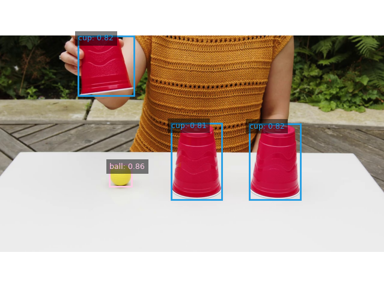

---

# Language-to-Segment&Track

Language-driven visual segmentation and object tracking system based on [Grounding-DINO](https://github.com/IDEA-Research/GroundingDINO) and [Samurai](https://github.com/yangchris11/samurai).

---


### 🔍 What Can It Do?

#### For Images:
- Accepts a text prompt and returns:
  - Label
  - Score
  - Bounding Box
  - Segmentation Mask
- Supports **batch processing** of images



#### For Video Files:
- Allows initializing multiple object tracks via a bounding box list in the first frame
- Enables **interactive tracking and segmentation** on any frame using:
  - Mouse click
  - Manual box drawing
  - Text prompt

#### For Real-Time Video (Camera):
> Default camera supported is Intel RealSense. For others, please modify the video capture method manually.

- Interactive tracking and segmentation with:
  - Mouse click
  - Manual box
  - Text input

https://github.com/user-attachments/assets/40a340c7-d818-493f-b86a-bb8ed5ca517c

---

### ❓ Why Use [Samurai](https://github.com/yangchris11/samurai)? How is it Different from [SAM2](https://github.com/facebookresearch/sam2)?

- **Samurai** is a zero-shot visual tracking model based on SAM2
- It outperforms SAM2 in **visual tracking capabilities**

📊 *Insert comparison video here*

---

## 🚀 Get Started

We recommend using **Anaconda** for environment management.

### ✅ Prerequisites

- OS: Ubuntu >= 18.04  
- NVIDIA Driver (`nvidia-smi`) >= **550**

---

### 🛠 Installation

```bash
git clone https://github.com/wngkj/Lang2SegTrack.git
cd Lang2SegTrack

conda create -n lang2segtrack python=3.10
conda activate lang2segtrack

pip install torch==2.4.1 torchvision==0.19.1 --extra-index-url https://download.pytorch.org/whl/cu124

cd models/sam2
pip install -e .
pip install -e ".[notebooks]"

cd ../gdino
pip install -e .
```

---

### 📦 Download SAM2.1 Checkpoints

Place them into `sam2/checkpoints/`:

- [sam2.1_hiera_tiny](https://dl.fbaipublicfiles.com/segment_anything_2/092824/sam2.1_hiera_tiny.pt)
- [sam2.1_hiera_small](https://dl.fbaipublicfiles.com/segment_anything_2/092824/sam2.1_hiera_small.pt)
- [sam2.1_hiera_base_plus](https://dl.fbaipublicfiles.com/segment_anything_2/092824/sam2.1_hiera_base_plus.pt)
- [sam2.1_hiera_large](https://dl.fbaipublicfiles.com/segment_anything_2/092824/sam2.1_hiera_large.pt)

---

## Usage

- **For Image Processing:**
  ```bash
  python scripts/seg_img.py
  ```

- **For Video or Camera Stream:**
  ```bash
  python scripts/segtrack_realtime.py
  ```

---

## 🙏 Acknowledgments

This project builds upon outstanding prior work:

- [GroundingDINO](https://github.com/IDEA-Research/GroundingDINO)
- [Samurai](https://github.com/yangchris11/samurai)
- [SAM2](https://github.com/facebookresearch/sam2)
- [Lang-Segment-Anything](https://github.com/luca-medeiros/lang-segment-anything)
